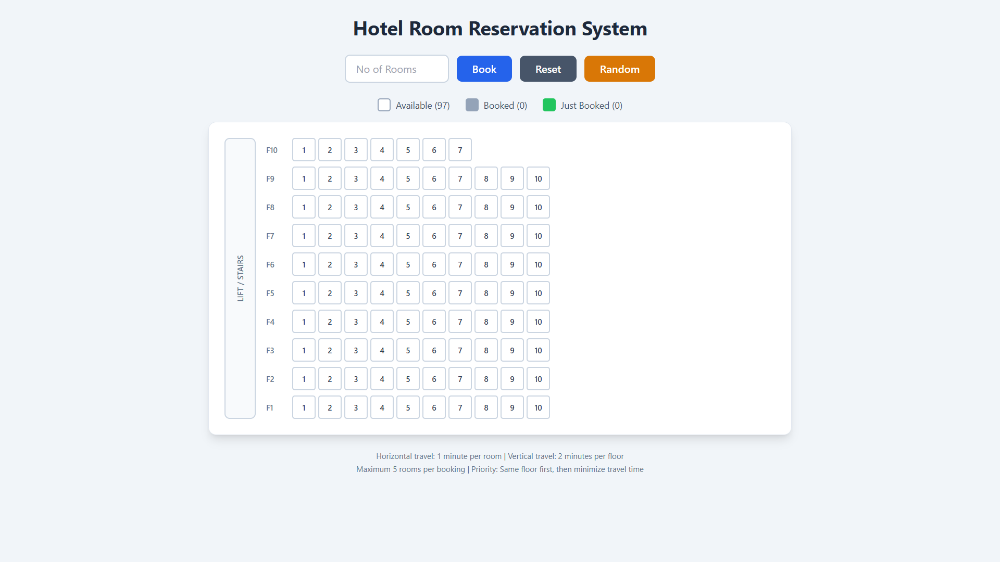

# Hotel Room Reservation System

A web-based hotel room reservation system that dynamically calculates optimal room allocation based on travel time minimization.

## Overview

This application simulates a hotel with 97 rooms distributed across 10 floors. It implements an intelligent booking algorithm that assigns rooms to minimize total travel time between booked rooms.

## Building Structure

### Floor Layout
- **Floors 1-9**: Each floor has 10 rooms numbered sequentially
  - Floor 1: Rooms 101-110
  - Floor 2: Rooms 201-210
  - ...
  - Floor 9: Rooms 901-910
- **Floor 10 (Top Floor)**: Has only 7 rooms numbered 1001-1007

### Physical Layout
- A staircase and lift are located on the **left side** of the building
- Rooms on each floor are arranged **left to right**
- The first room on each floor (e.g., 101, 201) is closest to the stairs/lift

## Travel Time Calculation

| Movement Type | Time Cost |
|---------------|-----------|
| Horizontal (between adjacent rooms on same floor) | 1 minute per room |
| Vertical (between floors via stairs/lift) | 2 minutes per floor |

### Example
- Travel from Room 101 to Room 105: `|5 - 1| = 4 minutes`
- Travel from Room 101 to Room 201: `|2 - 1| × 2 = 2 minutes`
- Travel from Room 101 to Room 305: `(|3 - 1| × 2) + |5 - 1| = 4 + 4 = 8 minutes`

## Booking Rules

1. **Maximum Booking**: A single guest can book up to **5 rooms** at a time
2. **Same Floor Priority**: The system first attempts to book all rooms on the same floor
3. **Travel Time Optimization**: If rooms must span multiple floors, the system selects the combination that minimizes total travel time
4. **Consecutive Preference**: When possible, consecutive rooms are preferred for minimal horizontal travel

## Algorithm

### Room Selection Process

1. **Same Floor Search**: Find the best combination of rooms on a single floor
   - Iterates through each floor with sufficient available rooms
   - Selects consecutive room combinations
   - Calculates travel time for each combination
   - Returns the combination with minimum travel time

2. **Cross-Floor Search**: If same-floor allocation is not possible
   - For small datasets (≤15 available rooms): Exhaustive combination search
   - For larger datasets: Optimized sliding window across adjacent floors
   - Selects the combination with minimum combined vertical and horizontal travel time

### Travel Time Formula

For a set of rooms, total travel time is calculated as the sum of travel times between consecutive rooms (when sorted):

```
Total Time = Σ (|floor_diff × 2| + |position_diff|)
```

## Features

### User Interface
- **Room Count Input**: Enter number of rooms to book (1-5)
- **Book Button**: Execute the booking with optimal room selection
- **Reset Button**: Clear all bookings and start fresh
- **Random Button**: Randomly book 30% of rooms for testing scenarios

### Visual Indicators
- **White boxes**: Available rooms
- **Gray boxes**: Already booked rooms
- **Green boxes**: Rooms just booked in the current transaction

### Information Display
- Real-time count of available and booked rooms
- Booking confirmation with selected room numbers
- Total travel time between booked rooms
- Error messages for invalid inputs or insufficient availability

## Tech Stack

- **Framework**: Next.js 14+ (App Router)
- **Language**: TypeScript
- **Styling**: Tailwind CSS
- **Package Manager**: Bun
- **Runtime**: Node.js

## Project Structure

```
├── app/
│   ├── layout.tsx          # Root layout with metadata
│   ├── page.tsx            # Main booking interface (client component)
│   └── lib/
│       └── booking.ts      # Core booking logic and algorithms
├── package.json            # Project dependencies
├── tsconfig.json           # TypeScript configuration
├── tailwind.config.js      # Tailwind CSS configuration
├── postcss.config.js       # PostCSS configuration
└── next.config.js          # Next.js configuration
```

## Core Module: `booking.ts`

### Types

```typescript
interface Room {
  number: number;      // Room number (e.g., 101, 1001)
  floor: number;       // Floor number (1-10)
  position: number;    // Position on floor (1-10 or 1-7)
  isBooked: boolean;   // Booking status
}

interface BookingResult {
  rooms: number[];     // Array of booked room numbers
  travelTime: number;  // Total travel time in minutes
  success: boolean;    // Whether booking was successful
  message: string;     // User-friendly message
}
```

### Key Functions

| Function | Description |
|----------|-------------|
| `initializeRooms()` | Creates the initial 97-room hotel structure |
| `findOptimalRooms(rooms, count)` | Main booking algorithm - finds best rooms |
| `calculateTravelTime(rooms)` | Calculates total travel time for a room set |
| `getRoomFloor(roomNumber)` | Extracts floor from room number |
| `getRoomPosition(roomNumber)` | Extracts position from room number |
| `randomizeBookings(rooms, percentage)` | Randomly books a percentage of rooms |

## Installation & Setup

### Prerequisites
- Node.js 18+ or Bun runtime
- npm, yarn, or bun package manager

### Installation

```bash
# Clone the repository
git clone <repository-url>
cd hotel-room-reservation

# Install dependencies
bun install
# or
npm install

# Start development server
bun dev
# or
npm run dev
```

### Build for Production

```bash
bun run build
bun start
```

## Usage Examples

### Scenario 1: Booking 4 rooms with full availability
- Input: 4 rooms
- Result: Rooms 101, 102, 103, 104 (consecutive on Floor 1)
- Travel Time: 3 minutes

### Scenario 2: Floor 1 has only rooms 101, 102, 105, 106 available
- Input: 4 rooms
- Result: Rooms 101, 102, 105, 106 (same floor, minimal travel)
- Travel Time: 5 minutes

### Scenario 3: Floor 1 has only 101, 102; Floor 2 has 201, 202, 203
- Input: 4 rooms
- Result: Rooms 201, 202, 203, and either 101 or 204 depending on availability
- The algorithm selects the combination with minimum total travel time

## API Reference

### Client-Side State Management

The application uses React's `useState` and `useCallback` hooks for state management:

- `rooms`: Array of all 97 rooms with their booking status
- `roomCount`: User input for number of rooms to book
- `lastBookedRooms`: Array of room numbers from the most recent booking
- `message`: Feedback message displayed to the user
- `travelTime`: Calculated travel time for the current booking

## Overview


## Live Demo
[Hotel Room Reservation System](https://hotel-room-reservation-sy.vercel.app/)

## Testing

Use the **Random** button to simulate various booking scenarios:
1. Click "Random" to pre-book 30% of rooms
2. Enter a number (1-5) in the input field
3. Click "Book" to see how the algorithm handles fragmented availability
4. Observe the selected rooms and calculated travel time

## License

MIT License - See LICENSE file for details


